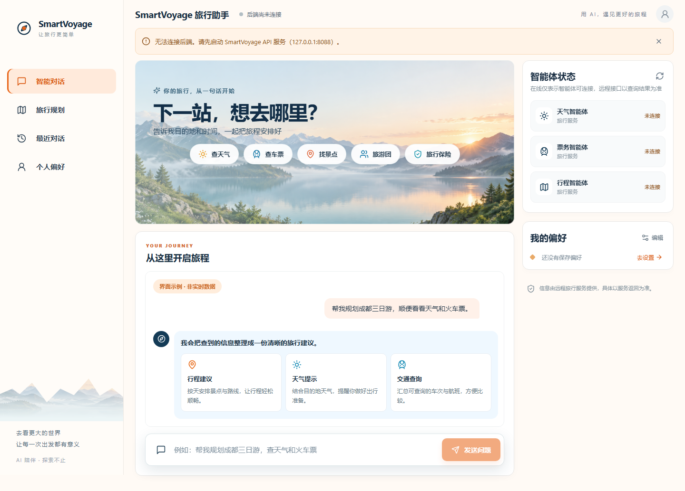
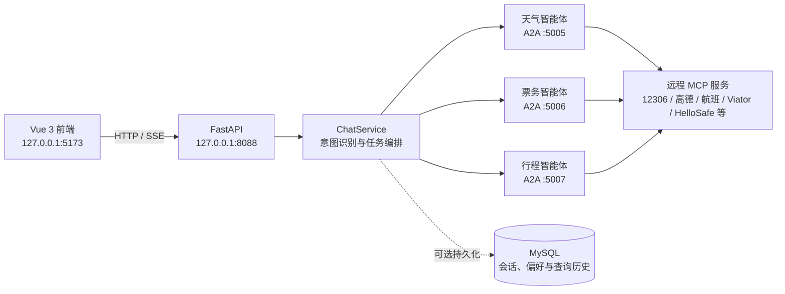

# SmartVoyage 旅行智能助手

SmartVoyage 是一个基于 **Vue 3、FastAPI、A2A 和远程 MCP** 的多智能体旅行助手。用户可以在网页中描述出发地、目的地、日期和偏好，系统会根据意图调用天气、票务或行程智能体，整理远程旅行服务返回的结果。

当前项目的业务查询通过远程 MCP 完成，网页请求链路如下。

## 页面预览



页面包含旅行对话、行程规划、偏好设置和智能体状态区域。GitHub 打开本 README 后可直接查看页面效果。

## 主要功能

- 旅行对话：支持连续提问、Markdown 回复和 SSE 进度提示。
- 天气与地图：通过高德远程 MCP 查询。
- 交通票务：支持火车、航班等远程查询能力。
- 行程服务：支持景点、旅游团、旅行保险和租车信息查询。
- 旅行规划：将日期、城市、预算等表单信息整理成旅行问题。
- 用户偏好：保存旅行节奏、预算、兴趣主题、交通偏好及自定义偏好。
- 对话记忆：保留当前短期对话、偏好和查询记录；MySQL 可用于持久化。
- 智能体状态：前端显示三路 A2A 智能体的连接状态。

## 能力边界

- 票价、余票、天气、产品和保险信息以远程服务实际返回为准。
- 系统没有接入实名购票、支付或正式下单接口，不会宣称已经完成预订。
- 某个远程 MCP 不可用时会返回缺失或失败说明，不使用本地样例数据伪造实时结果。
- “最近对话”展示当前加载的短期记忆，暂不支持多个独立会话的切换与恢复。
- `/api/chat/stream` 会先返回执行进度，再将完整回答分片发送；它不是模型逐 Token 输出。

## 系统架构



实际调用链为：

```text
Vue 前端 → FastAPI → ChatService → 本地 A2A 智能体 → remote_mcp.py → 远程 MCP
```

## 技术栈

| 层级 | 技术 |
| --- | --- |
| 前端 | Vue 3、Vite、Markdown-It、DOMPurify、Lucide Icons |
| API | FastAPI、Uvicorn、SSE |
| 智能体编排 | LangChain、A2A、ChatOpenAI 兼容接口 |
| 工具调用 | MCP Streamable HTTP、`langchain-mcp-adapters` |
| 数据存储 | MySQL（短期消息、偏好、查询记录） |
| 依赖管理 | uv、npm |

## 项目结构

```text
SmartVoyage-Publish/
├─ frontend/                    # 当前 Vue 网页
│  ├─ src/App.vue              # 页面与接口交互
│  └─ src/style.css            # 页面样式
├─ SmartVoyage/
│  ├─ api_server.py            # FastAPI 接口，端口 8088
│  ├─ main.py                  # 启动三路 A2A 服务
│  ├─ chat_service.py          # 意图识别、任务分发与结果汇总
│  ├─ memory.py                # 对话记忆与 MySQL 持久化
│  ├─ remote_mcp.py            # 当前远程 MCP 连接配置
│  ├─ a2a_server/              # 天气、票务、行程 A2A 智能体
│  ├─ tests/                   # 接口与远程服务检查脚本
│  ├─ logs/                    # 运行日志
│  └─ docker/                  # 数据库配置和初始化脚本
├─ .env.example                # 远程服务配置模板
├─ pyproject.toml              # Python 项目与依赖
└─ README.md
```

## 环境要求

- Windows PowerShell（当前项目主要在 Windows 环境运行）
- Python 3.12 或更高版本
- [uv](https://docs.astral.sh/uv/)
- Node.js 20 LTS 与 npm
- 可访问所配置远程 MCP 的网络
- MySQL 5.7（仅在需要持久化对话和偏好时必需）

## 配置

### 1. 安装依赖

在项目根目录执行：

```powershell
uv sync
cd frontend
npm ci
cd ..
```

### 2. 创建环境配置

```powershell
Copy-Item .env.example .env
```

至少需要配置大模型密钥和高德服务。可以直接把以下变量补充到 `.env`：

```dotenv
DASHSCOPE_API_KEY=your-dashscope-api-key
DASHSCOPE_API_URL=https://dashscope.aliyuncs.com/compatible-mode/v1
DASHSCOPE_MODEL=qwen3.6-plus

AMAP_MAPS_API_KEY=your-amap-api-key
VARIFLIGHT_API_KEY=
HELLOSAFE_MCP_URL=
HELLOSAFE_MCP_TOKEN=

# 需要 MySQL 持久化时填写
MYSQL_USER=smart_yoyage
MYSQL_PASSWORD=your-mysql-password
MYSQL_ROOT_PASSWORD=your-mysql-root-password
```

`.env.example` 还提供了下列远程端点覆盖项：

| 变量 | 用途 |
| --- | --- |
| `MCP_12306_URL` | 火车票服务 |
| `MCP_AMAP_URL` | 高德 MCP 完整地址；设置后优先于 `AMAP_MAPS_API_KEY` |
| `MCP_VARIFLIGHT_URL` | 航班动态服务 |
| `MCP_FLIGHT_FARE_URL` | 航班价格服务 |
| `MCP_BING_CN_URL` | 中文网页搜索 |
| `MCP_FETCH_URL` | 网页内容读取 |
| `MCP_VIATOR_URL` | 旅游体验和旅游团 |
| `HELLOSAFE_MCP_URL` | 旅行保险服务 |
| `HELLOSAFE_MCP_TOKEN` | 保险服务 Bearer Token |

请勿提交真实 `.env`。该文件已包含在 `.gitignore` 中。

### 3. 启动 MySQL（可选）

没有 MySQL 时，服务仍可使用内存中的短期记忆，但关闭进程后不会保留偏好与历史。需要持久化时，只启动 Compose 中的 MySQL：

```powershell
docker compose -f SmartVoyage/docker/docker-compose.yml up -d mysql
```

首次使用空数据库时，可运行初始化脚本：

```powershell
uv run python SmartVoyage/docker/data_init/run_sql_file.py
```

> 初始化脚本会重建 `travel_rag` 数据库并先要求确认。不要对需要保留数据的数据库执行该命令。

## 启动项目

需要打开三个 PowerShell 终端，并在每个终端中进入项目根目录。

### 终端 1：启动 A2A 智能体

```powershell
uv run --no-sync python -m SmartVoyage.main
```

该命令会启动：

- 天气智能体：`5005`
- 票务智能体：`5006`
- 行程智能体：`5007`

启动完成后请保持该终端运行。

### 终端 2：启动 FastAPI

```powershell
uv run --no-sync python -m SmartVoyage.api_server
```

接口文档：<http://127.0.0.1:8088/docs>

### 终端 3：启动 Vue 前端

```powershell
cd frontend
npm run dev
```

访问：<http://127.0.0.1:5173/>

## 服务端口

| 服务 | 地址或端口 | 必需 |
| --- | --- | --- |
| Vue 开发服务器 | `http://127.0.0.1:5173` | 是 |
| FastAPI | `http://127.0.0.1:8088` | 是 |
| 天气 A2A | `5005` | 是 |
| 票务 A2A | `5006` | 是 |
| 行程 A2A | `5007` | 是 |
| MySQL | `3306` | 持久化时需要 |

## API 概览

| 方法 | 路径 | 说明 |
| --- | --- | --- |
| `POST` | `/api/chat` | 返回一次完整聊天结果 |
| `POST` | `/api/chat/stream` | 通过 SSE 返回进度与分片内容 |
| `GET` | `/api/agents` | 获取三路智能体状态 |
| `GET` | `/api/memory` | 获取短期消息、偏好和查询历史 |
| `POST` | `/api/memory/profile` | 新增或更新用户偏好 |
| `POST` | `/api/memory/clear` | 清空当前记忆及已连接数据库中的记忆数据 |

聊天请求格式：

```powershell
Invoke-RestMethod -Method Post `
  -Uri http://127.0.0.1:8088/api/chat `
  -ContentType 'application/json' `
  -Body '{"message":"查询明天杭州的天气，并推荐两个景点"}'
```

## 构建与检查

前端生产构建：

```powershell
cd frontend
npm run build
```

检查 Python 文件能否编译：

```powershell
uv run --no-sync python -m compileall SmartVoyage
```

`SmartVoyage/tests` 中部分脚本会访问真实远程 MCP，结果会受到密钥、网络和第三方服务状态影响，不能当作完全离线的单元测试。

## 常见问题

### 页面能打开，但请求显示连接失败

1. 确认 `5005`、`5006`、`5007` 和 `8088` 均已监听。
2. 查看 `SmartVoyage/logs/` 中对应智能体日志。
3. 检查 `.env` 中的密钥和远程 MCP 地址。
4. 使用系统代理时，在启动后端的终端设置回环地址直连：

```powershell
$env:NO_PROXY='127.0.0.1,localhost'
$env:no_proxy='127.0.0.1,localhost'
```

### 智能体显示在线，但某项查询失败

“在线”只表示本地 A2A 服务可连接。远程 MCP、账号权限或第三方数据源仍可能独立失败，应以该次查询返回和日志为准。

### 偏好或历史在重启后消失

确认 MySQL 已启动，并且 `travel_rag` 中存在 `user_profiles`、`query_history` 和 `short_term_messages` 表。MySQL 不可用时，应用会继续运行，但仅保留进程内记忆。

## 相关文档

- [Vue 前端说明](frontend/README.md)
- [远程 MCP 版本说明](SmartVoyage/远程MCP启动说明.md)
- [任务编排问题修复记录](SmartVoyage/任务编排badcase修复说明.md)
